# AtExitManager 模�技术设计说�

## 1. 文档目标�范�

本文档��`neixx/common` �`AtExitManager` �`Singleton` �系统的设计目标�
API 语义�线程模��死�防御机制�Leaky Singleton 集�模��*关机��
（Race on Shutdown）防�*，并**专门�§5 中深入分���库多模�链�的数�段多副本
问题**�*�§7 中��Chromium �Leaky Singleton 哲学**�
**�§11 中��Singleton 模��Traits 策略��**�

本文档基�：

- `modules/neixx/common/include/neixx/common/at_exit.h`（公开 API�
- `modules/neixx/common/include/neixx/common/singleton.h`（泛��例容�+ Traits�
- `modules/neixx/common/src/at_exit.cpp`（��）
- `modules/neixx/io/include/neixx/io/io_buffer.h`（Leaky Singleton �入示范�
- `modules/neixx/io/src/io_buffer.cpp`（`IOBufferPool::GetInstance` 改�+ Traits 特化�

## 2. 模�定�

`AtExitManager` �`neixx` �供�*进程全局有��机设施**，对�Chromium �
`base::AtExitManager`�

| 能力 | 说� |
|------|------|
| **LIFO �调�* | �注册的�调先执行，匹� C++ ��语义 |
| **RAII 生命周期** | `main()` 栈顶�造，return 时自动��触�全���|
| **线程安全注册** | 任�线程�在任�时刻通过 `RegisterCallback` �入�调 |
| **�外触�防死�* | �调执行时���有内部互斥�，彻底���入死�|
| **显�中途��* | `ProcessCallbacksNow()` 支�在进程存活期间��清空�调栈 |

该模�是整个进程退出秩�的**根设�*。所�`Leaky Singleton`（如 `IOBufferPool`�
的���调��赖它��安全有�的�机�

## 3. API ��

### 3.1 类声�

```cpp
class NEI_API AtExitManager {
public:
    using Callback = std::function<void()>;

    AtExitManager();                              // 注册为进程全局管�器（最多一个）
    ~AtExitManager();                             // 自动调用 ProcessCallbacksNow()

    AtExitManager(const AtExitManager&) = delete;
    AtExitManager& operator=(const AtExitManager&) = delete;

    static bool RegisterCallback(Callback cb);    // 线程安全注册
    static void ProcessCallbacksNow();            // 显� LIFO �出
};
```

### 3.2 基本用法

```cpp
int main() {
    nei::AtExitManager at_exit;  // 必须�main() 的第一个栈对象

    // 注册清��调（LIFO：�注册先执行）
    AtExitManager::RegisterCallback([] { CleanupA(); });
    AtExitManager::RegisterCallback([] { CleanupB(); });
    // 退出时：先执行 CleanupB，�执行 CleanupA

    return 0;
}
```

### 3.3 RegisterCallback 返��

| 返��| �义 | 常��因 |
|--------|------|---------|
| `true` | �调已��LIFO �| 正常路径 |
| `false` | 无活跃的 AtExitManager | ��`main()` 之�调用；② **DLL �有独立的��库副本**（� §5�|

### 3.4 ProcessCallbacksNow

```cpp
// 在进程存活期间显�清空�调栈（AtExitManager 本身�存活）
AtExitManager::ProcessCallbacksNow();

// 此��继续注册新�调，它们将在下次�出（显�调用�~AtExitManager）时执行
AtExitManager::RegisterCallback([] { LateCleanup(); });
```

## 4. ��设计

### 4.1 核心数�结�

```
┌─ AtExitManager (��� ─────────────────────────────�
â”?                                                       â”?
� static AtExitManager* g_top_manager_  �进程唯一指针   �
� static std::mutex     lock_           ��护以下所有���
â”?                                                       â”?
� std::vector<Callback> stack_          �LIFO �调�   �
â”?                                                       â”?
â”? RegisterCallback(cb):                                 â”?
�   lock_ �stack_.push_back(cb) �unlock               �
â”?                                                       â”?
â”? ProcessCallbacksNow():                                â”?
�   lock_ �local.swap(stack_) �unlock                 �
�   for (auto& cb : reverse(local)) cb();  ��外执行!   �
└────────────────────────────────────────────────────────�
```

### 4.2 数�段布局

```
┌────────────────── DLL/SO ──────────────────�  ┌────────── EXE ────────────�
�at_exit.cpp 中定�                          �  ��调�public �员函数:     �
â”?  g_top_manager_  = nullptr  (.bss)         â”?  â”?  AtExitManager::         â”?
â”?  lock_                     (.data)         â”?  â”?    RegisterCallback()    â”?
�stack_ (�个 AtExitManager �例�有)          �  �  �访问任�private �����
â”?                                             â”?  â”?                          â”?
�编译器�� DLL 数�段在进程内�有一�         �  �链�方�: 导入 DLL 的符�表    �
└──────────────────────────────────────────────�  └───────────────────────────�
```

在共享库模�下，`g_top_manager_` �`lock_` 存在�DLL/SO 的数�段中，所有消费者通过
导入表访问�一份数�，全进程唯一�

## 5. ��库多模�链�问题（深度分��

> **这是本模�最��的使用约�，必须在项目设计阶段就�解清楚�*

### 5.1 问题的根�：��库的链�语�

��库（`.lib` / `.a`）�是�作系统加载�元，而是编译�元的归档集�。当链�器处�
��库时，它将所需�`.obj`/`.o` **�制**到最终二进制文件中：

```
链��
  neixx.lib
    └── at_exit.obj
          ├── g_top_manager_  (定义)
          ├── lock_           (定义)
          └── AtExitManager::RegisterCallback() { ... }

链��（EXE + DLL �自链� neixx.lib�

  myapp.exe                           myplugin.dll
  ┌──────────────────────────�       ┌──────────────────────────�
  �at_exit.obj 的副�#1     �       �at_exit.obj 的副�#2     �
  â”?  g_top_manager_ = 0x1000â”?       â”?  g_top_manager_ = 0x2000â”?
  �  lock_           �例 #1 �       �  lock_           �例 #2 �
  â”?  RegisterCallback() #1  â”?       â”?  RegisterCallback() #2  â”?
  └──────────────────────────�       └──────────────────────────�
           �独立数��                      �独立数��
```

**关键事�**：`g_top_manager_`�`lock_` �`stack_` �是"跨模�共享的全局��"�
而是"�个链��元内的独立副本"�

### 5.2 故障演示

```cpp
// ========== myapp.exe ==========
int main() {
    nei::AtExitManager at_exit;           // g_top_manager_#1 = &at_exit
    LoadLibrary("myplugin.dll");
    PluginFunc();                         // �调用 DLL 中的代�
    return 0;
}  // ~AtExitManager: ��出副�#1 �stack_

// ========== myplugin.dll (也链�了 neixx.lib) ==========
void PluginFunc() {
    // 这里�RegisterCallback 访问的是副本 #2!
    nei::AtExitManager::RegisterCallback([] {
        // 这个�调被�入副�#2 �stack_
        // 但副�#2 �g_top_manager_ 永远�nullptr
        // �RegisterCallback 返� false，�调被丢弃
        ReleasePluginResources();
    });
}
```



```mermaid
sequenceDiagram
    participant EXE as myapp.exe (副本 #1)
    participant DLL as myplugin.dll (副本 #2)

    EXE->>EXE: AtExitManager at_exit<br/>g_top_manager_#1 = &at_exit
    EXE->>DLL: LoadLibrary + PluginFunc()
    DLL->>DLL: RegisterCallback(cb)<br/>检�g_top_manager_#2 == nullptr<br/>�return false �
    Note over DLL: �调被�默丢�
    EXE->>EXE: ~AtExitManager<br/>��出副�#1 �stack_<br/>DLL 的�调�未被注册
```

### 5.3 �影�的所有组�

此问题��� `AtExitManager`�*所�*�`.cpp` 中定义文件作用域��全局���
`neixx` 组件都存在�样�险：

| 组件 | �影�的数� | 故障表� |
|------|-------------|---------|
| `AtExitManager` | `g_top_manager_`, `lock_` | DLL �调�默丢弃 |
| `IOBufferPool`（如使用 Meyers' Singleton）| `static IOBufferPool pool` | EXE �DLL �自一个池，内存翻�|
| 任何使用 `NEI_DEFINE_GLOBAL` 或文件作用域 `static` 的组�| �自的����| 状�分裂，互��� |

�**Leaky Singleton 模�**（`new` + `AtExitManager::RegisterCallback`）在
`GetInstance()` 中使�`static std::once_flag` + `static T*` —�这些�样�
�个链��元独立副本。DLL 调用 `GetInstance()` 会在 DLL 内部创建一个独立�例�

### 5.4 检测手�

#### 编译期：无法检�

C++ 没有跨翻译�元的"全局��唯一�检查机制。链�器在��链�时��并��二进制
中的��符�（Windows 上会报��符�错误，但这�生在�一二进制内；��DLL/EXE
之间的符�天然隔离）�

#### �行时：RegisterCallback 返� false 是唯一信�

```cpp
bool ok = nei::AtExitManager::RegisterCallback([] { Cleanup(); });
if (!ok) {
    // �能�因�
    // 1. AtExitManager 尚未创建（在 main 之�调用�
    // 2. 当�模��有独立的��库副本（多模�链��
    LOG_WARN("AtExitManager::RegisterCallback failed �no active manager");
}
```

#### Windows 辅助检测（�选）

�利�Windows �`GetModuleHandleEx` 判断当�代�所在的模��

```cpp
// 仅供诊断使用
HMODULE caller_module = nullptr;
GetModuleHandleEx(
    GET_MODULE_HANDLE_EX_FLAG_FROM_ADDRESS |
    GET_MODULE_HANDLE_EX_FLAG_UNCHANGED_REFCOUNT,
    reinterpret_cast<LPCTSTR>(&AtExitManager::RegisterCallback),
    &caller_module);
// 如� caller_module != neixx 所�DLL �HMODULE�
// 说�当�代��行在�一个模�的副本�
```

### 5.5 解决方案选择矩阵

| 方案 | 适用场景 | 代价 |
|------|---------|------|
| **A) 约定：�链��EXE** | �体进程，无�件�� | 零�行时开销 |
| **B) 强制共享库��* | 存在动�加载的 DLL �件 | 需分� DLL/SO |
| **C) �作系统级共享内�* | DLL 必须��链�neixx | `CreateFileMapping` + 跨模��步，��度��|
| **D) PIMPL + 导出工�** | 需�ABI 稳定 + 跨模�| `AtExitManager` ��完全通过虚表调用 |

**当���**�

- **开�测试阶段**：方�A（��库�链�进测试 EXE），�Chromium 自身�践一�
- **正��版�*：评估是�需�支��件��。若需�，切�到方�B（共享库�建�
- **方案 C/D** 暂���：过度工程化，Chromium 也未采用

### 5.6 �Chromium 的对�

| 维度 | Chromium (`base::AtExitManager`) | `nei::AtExitManager` |
|------|----------------------------------|----------------------|
| ����| `g_top_manager` (文件作用域，`lazy_instance.cc`) | `g_top_manager_` (`at_exit.cpp`) |
| 多模�处�| **组件�建** (`is_component_build=true`) �`base.dll` 全进程共�| �左：`BUILD_SHARED_LIBS=ON` |
| ���建约�| `base` �链�进 `chrome.exe`，DLL �链�`base` | �左：�链�进最�EXE |
| 文档化程�| ��约定，��建系统�� | 本文�§5 显�文档�|

Chromium 通过 GN �建系统�`component()` 声��管�这一约�，任何��的�赖关系
会在 GN gen 阶段被拦截。我们的 CMake �建目��具备此级别的�赖分�，因此**文档�
约�**是最务�的方案�

## 6. 线程安全�死�防�

### 6.1 �的使用�议

```
RegisterCallback(cb):
  lock_.lock()
    stack_.push_back(cb)
  lock_.unlock()

ProcessCallbacksNow():
  lock_.lock()
    local.swap(stack_)       �整栈移出，stack_ �为�
  lock_.unlock()             ��在此处释放
  for (auto& cb : reverse(local))
    cb()                     ��调在�外执�
```

### 6.2 为什么�外触�至关��

�设�调在�有�时执行：

```cpp
// ��险的�模�
void ProcessCallbacksNow() {
    std::lock_guard<std::mutex> lock(lock_);
    while (!stack_.empty()) {
        auto cb = std::move(stack_.back());
        stack_.pop_back();
        cb();  // ��有� 如� cb 内部调用 RegisterCallback �死�
    }
}
```

�调内部�能�
1. 调用 `RegisterCallback` ��试�� `lock_` �**死�**
2. 触��一个线程的 `ProcessCallbacksNow` ��试�� `lock_` �**死�**
3. 销��个对象，对象��中调�`RegisterCallback` �**死�**

**swap-then-execute 模�** �Chromium �`AtExitManager`�`MessageLoop`�
`TaskRunner` 等多处使用的标准防死�惯用法�

### 6.3 ~AtExitManager 中的�争窗�

```
~AtExitManager() {
    ProcessCallbacksNow();     // ��出所有已注册�调
    //  �微�的�争窗�：�一个线程�能在此时注册新��
    lock_.lock();
    if (g_top_manager_ == this)
        g_top_manager_ = nullptr;  // �此� RegisterCallback 返� false
    lock_.unlock();
}
```

此窗�内注册的��*永远�会被执�*。这�Chromium 中也存在（� `AtExitManager`
场景下），是进程退出时���的�衡�

## 7. Leaky Singleton 集�模��关机��防�

### 7.1 致命场景：��期��（Race on Shutdown�

�§6.3 中�述了 `~AtExitManager` 的�争窗�。当这个窗��`IOBufferPool` �
核心底层�例的懒加载结�时，会演��**堆内存泄露断�*�

```
时��
  主线�                               �� I/O 线程
  ────────                              ────────────
  ~AtExitManager()
    ProcessCallbacksNow()
      执行 delete pool �调
        ~IOBufferPool()                    醒�，需�分�buffer
        g_pool = nullptr                   IOBufferPool::GetInstance()
                                             g_pool == nullptr �true
                                               new IOBufferPool()  ��新创建!
                                               RegisterCallback(delete)
                                                 g_top_manager_ ���
                                                 stack_.push_back(cb) ��入�功
      �调执行完毕
    lock_ �g_top_manager_ = nullptr
    �pool �delete �调永�被执�💀
```

**最终��*：��线程在��临界区�新创建了一�`IOBufferPool` �例，其销�闭�
虽然被�功�入了 `stack_`，但 `g_top_manager_` ��被置�`nullptr`。这个新�例
��其内部积�的所�4K/64K 缓冲�*永远�会被释�*——��堆内存泄露�

### 7.2 Chromium 的终�防线：真正�Leaky Singleton

�对这�几�无法通过纯加�完��开的系统级乱���，Chromium 给出的方案是�

> **�对���`AtExitManager` �调�`delete` �例自身�*

正确�Leaky Singleton ��两件事：
1. **释放内部�有的物�资�*（如 `free_blocks` 中所�`unique_ptr<char[]>` 裸内存）
2. **���例的外壳指针永远有效且�访�*

这样�的收益�

| 收益 | 说� |
|------|------|
| **彻底规�崩溃** | ��残留线程在退出期间访问�例，�然拿到有效指针，����`0x00000000` 段错�|
| **拒�乱�死�** | �需�为�护�例消亡设计��的跨线程阻断�|
| **OS 终��收** | 进程退出时�作系统一把抹�所有虚拟地�空间，�例外壳的几百字节�OS �收 |

### 7.3 模�对比

```cpp
// ��险�"delete �例" 模� �关机��下会崩溃或泄露
T& GetInstance() {
    static T* ptr = nullptr;
    static std::once_flag flag;
    std::call_once(flag, [] {
        ptr = new T();
        AtExitManager::RegisterCallback([] { delete ptr; });  // ��险!
    });
    return *ptr;
}

// �真正�Leaky Singleton ��清�资�，�销�外�
T& GetInstance() {
    static T* g_ptr = nullptr;
    static std::mutex g_lock;

    if (g_ptr == nullptr) {
        std::lock_guard lock(g_lock);
        if (g_ptr == nullptr) {
            g_ptr = new T();
            bool ok = AtExitManager::RegisterCallback([] {
                g_ptr->ReleaseInternalResources();  // ��清�内部资�
                // 故��delete g_ptr
            });
            CHECK_MSG(ok, "T::GetInstance: AtExitManager missing.");
        }
    }
    return *g_ptr;
}
```

### 7.4 IOBufferPool �地��（基�Singleton 模��

�际代�委托�`Singleton<IOBufferPool, LeakySingletonTraits<IOBufferPool>>`�
并在 `io_buffer.cpp` 中��Traits 特化�

```cpp
// neixx/io/src/io_buffer.cpp

// 特化：�清�缓存，�删除外壳
template <>
void LeakySingletonTraits<IOBufferPool>::Delete(IOBufferPool* x) {
    if (x) {
        x->PurgeMemory();
        // 故��delete x �Leaky Singleton 哲学
    }
}

IOBufferPool& IOBufferPool::GetInstance() {
    return *Singleton<IOBufferPool, LeakySingletonTraits<IOBufferPool>>::GetInstance();
}
```

`Singleton<T, Traits>::GetInstance()` 自动处��
1. Double-Checked Locking（`std::atomic` + acquire-release �障�
2. `Traits::New()` �`new IOBufferPool()`
3. `AtExitManager::RegisterCallback()` �退出时调用 `Traits::Delete()`
4. `CHECK_MSG` 确� AtExitManager 存在

### 7.5 关机�的�例状�

```
~AtExitManager 执行�
  IOBufferPool {
    buckets_ = [
      { block_size=4K,  free_blocks=[buf0, buf1, ..., buf255] },
      { block_size=64K, free_blocks=[buf0, buf1, ..., buf63]  },
    ]
  }

PurgeMemory() 执行�
  IOBufferPool {
    buckets_ = [
      { block_size=4K,  free_blocks=[] },   �全部释放，物�内存归�OS
      { block_size=64K, free_blocks=[] },   �全部释放，物�内存归�OS
    ]
    // 对象自身 (~200 bytes) �然存活
  }

进程退�
  OS �收 IOBufferPool �~200 bytes + 所有虚拟地�空间
```

### 7.6 ��库多模�场景下的注�事�

Leaky Singleton 在��库多模�场景下�样�§5 �述的数�段多副本问题影�：
�个 DLL 调用 `GetInstance()` 会在 DLL 内部创建自己的独立�例和独立�
`g_pool` 指针。这�是 `AtExitManager` 独有的问题，解决方案�§5.5�

## 8. 最佳�践��模�

### 8.1 ���

```cpp
int main() {
    nei::AtExitManager at_exit;          // 1. 第一�

    // 2. �始化所�Leaky Singleton
    auto& pool = nei::IOBufferPool::GetInstance();

    // 3. 注册应用级清���
    AtExitManager::RegisterCallback([] {
        FlushPendingLogs();
    });

    // 4. 业务逻辑
    RunApplication();

    return 0;                            // 5. ~AtExitManager 自动清�
}
```

### 8.2 ��模�

| �模�| �� | 正确�法 |
|--------|------|---------|
| `AtExitManager` �是第一个栈对象 | 其他对象的��在�调**之�**执行，�调�能访问已��对象 | `at_exit` 必须�`main()` 的第一�语�|
| �DLL 中创�`AtExitManager` | DLL �EXE �自一个管�器，混�| �在 EXE �`main()` 中创�|
| 在�调中���级 I/O | 阻�其他�调执行，延长退出时�| �调��轻�清�（`delete`�`close`�`flush`�|
| �赖�调执行顺��业务逻辑 | LIFO 是约定，但��API �� | 注册顺��影�清�顺�，�应用�业务�制�|
| `RegisterCallback` �检查返��| �调�能�默丢失 | Debug �建�`DCHECK(ok)`，关键路径用 `CHECK_MSG` |
| **�AtExit �调�`delete` �例自身** | ��线程�入 �UAF 崩溃或孤儿�例泄�| �释放内部资�，�留�例外壳（�.2�|

### 8.3 RegisterCallback 返�值检�

```cpp
// ��的防御性写�
void RegisterCleanup(std::function<void()> cb) {
    bool ok = nei::AtExitManager::RegisterCallback(std::move(cb));
    DCHECK(ok) << "AtExitManager::RegisterCallback failed �"
               << "no active AtExitManager.  Possible causes:\n"
               << "  1. Called before main() created the AtExitManager.\n"
               << "  2. Called from a DLL with a separate static copy of neixx.";
}
```

## 9. �Chromium `base::AtExitManager` 的差�

| 维度 | Chromium | neixx (本�� |
|------|---------|---------------|
| �调类� | `base::OnceClosure`（move-only�| `std::function<void()>`（更�活，��制�|
| 命�空间 | `base::` | `nei::` |
| 注册方法 | `RegisterCallback(base::OnceClosure)` | `RegisterCallback(std::function<void()>)` |
| 嵌套管��| 支�（使用链�`next_manager_`�| **�支�*（�一进程��许一个） |
| 栈深度检�| `kMaxAtExitCallbacks = 40`（debug 断言�| 无��|
| 返�注册状�| `void`（失败时 CHECK�| `bool`（返�false 表示无活跃管�器�|
| 文件�置 | `base/at_exit.h` / `at_exit.cc` | `neixx/common/include/neixx/common/at_exit.h` |
| 头文件�赖隔�| `base/functional/callback.h` | `<functional>` 标准库，无项目内�调�赖 |

**设计�由**�

- **�支�嵌套管�器**：Chromium 需�在�元测试中频�创�销�`AtExitManager`�
  neixx 在�进程场景下�需�此��度。未�如需支�测试夹具，�添加�
- **`std::function` 而� `OnceCallback`**：��对 `neixx/functional` 的循��赖，
  �时�供更大的�活性�
- **返� `bool`**：在库代�中，返�false 比直�CHECK 更�好，调用方�自行决定
  如何处��

## 10. 文件清�

| 文件 | 角色 |
|------|------|
| `modules/neixx/common/include/neixx/common/at_exit.h` | AtExitManager 公开 API |
| `modules/neixx/common/include/neixx/common/singleton.h` | Singleton 泛�容器 + Traits |
| `modules/neixx/common/src/at_exit.cpp` | AtExitManager �� |
| `modules/neixx/io/include/neixx/io/io_buffer.h` | IOBufferPool 声�（friend Traits�|
| `modules/neixx/io/src/io_buffer.cpp` | LeakySingletonTraits 特化 + GetInstance |
| `demo/at_exit_demo.cpp` | 完整演示（���线程��测试） |
| `docs/neixx_at_exit_technical.md` | 本文�|

## 11. Singleton 模���

### 11.1 设计目标

`Singleton<T, Traits>` 是一个泛��例容器，通过 **Traits 策略模�** 将�例的
"内存分�"�销�时� �"线程安全" 彻底解耦。切�Traits ��在传统�例�
Leaky �例之间自由选择�

### 11.2 Traits ç­–ç•¥

```cpp
// 传统�例：退出时 delete
template <typename T>
struct DefaultSingletonTraits {
    static T* New()    { return new T(); }
    static void Delete(T* x) { delete x; }
};

// 泄露�例：永�delete（防关机崩溃�
template <typename T>
struct LeakySingletonTraits {
    static T* New()    { return new T(); }
    static void Delete(T* /*x*/) { /* intentionally empty */ }
};
```

对�需�释放内部资�但�删除外壳的类�（如 `IOBufferPool`），�在 `.cpp` 中��
**模�特化**�

```cpp
// io_buffer.cpp
template <>
void LeakySingletonTraits<IOBufferPool>::Delete(IOBufferPool* x) {
    if (x) {
        x->PurgeMemory();  // 释放 4K/64K 缓存�
        // 故��delete x
    }
}
```

### 11.3 线程安全：Double-Checked Locking + Acquire-Release

```
GetInstance():
  instance = instance_.load(memory_order_acquire)   �快速路�
  if (instance != nullptr) return instance;

  lock_.lock()                                      �慢速路�
    instance = instance_.load(memory_order_relaxed)
    if (instance == nullptr) {
      instance = Traits::New()
      AtExitManager::RegisterCallback([]{           �注册销�闭�
        Traits::Delete(instance_.load(relaxed))
      })
      CHECK_MSG(registered, "AtExitManager missing")
      instance_.store(instance, memory_order_release) ��布
    }
  lock_.unlock()
  return instance;
```

| �障 | 作用 |
|------|------|
| `acquire` | 确�看到�造线程对 T 的所有内存写�|
| `release` | 确� T �造完���将指针�布给其他线�|
| mutex | �内�供�外�acquire-release 语义 |

### 11.4 使用示例

```cpp
// 声�（在 .h 中）
class IOBufferPool {
public:
    static IOBufferPool& GetInstance();
private:
    IOBufferPool() = default;
    friend struct LeakySingletonTraits<IOBufferPool>;  // �许 Traits 访问��
};

// ��（在 .cpp 中）
IOBufferPool& IOBufferPool::GetInstance() {
    return *Singleton<IOBufferPool, LeakySingletonTraits<IOBufferPool>>::GetInstance();
}
```

### 11.5 �Chromium 的对�

| 维度 | Chromium `base::Singleton` | `nei::Singleton` |
|------|---------------------------|------------------|
| Traits 模� | `DefaultSingletonTraits` / `LeakySingletonTraits` / `StaticSingletonTraits` | �左（Default + Leaky�|
| 内存�障 | `subtle::AtomicWord` + `subtle::Acquire_Load` / `subtle::Release_Store` | `std::atomic<T*>` + `memory_order_acquire/release` |
| 死�防御 | `subtle::NoBarrier_Store` 在注�AtExit �| mutex + release store 等价 |
| AtExit 集� | `base::AtExitManager::RegisterCallback` | `nei::AtExitManager::RegisterCallback` |
| 文件�置 | `base/memory/singleton.h` | `neixx/common/include/neixx/common/singleton.h` |
