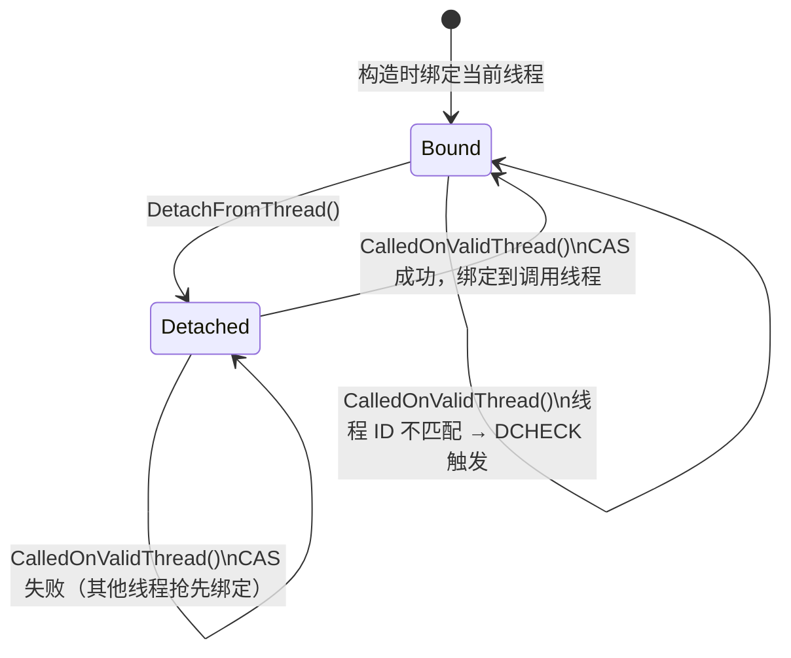

# ThreadChecker / SequenceChecker 技术设计说明

## 1. 文档目标与范围

本文档描述 `neixx/task` 中 `ThreadChecker` 与 `SequenceChecker` 两个线程安全校验器的
设计目标、API 语义、使用范式、Release 模式零开销机制，以及配套 TLS 基础设施的集成方式。

本文档基于：

- `include/neixx/task/thread_checker.h`
- `include/neixx/task/sequence_checker.h`
- `include/neixx/threading/platform_thread.h`（`PlatformThreadId`）
- `include/neixx/task/sequence_token.h`（`SequenceToken`）

## 2. 模块定位

| 组件 | 定位 | 对标 Chromium |
|------|------|--------------|
| `ThreadChecker` | 物理线程归属校验——检测"对象被错误的 OS 线程访问" | `base::ThreadChecker` |
| `SequenceChecker` | 逻辑序列归属校验——检测"对象被错误的序列化任务上下文访问" | `base::SequenceChecker` |
| `nei::internal::*SequenceToken*` | TLS 基础设施——将当前任务的 `SequenceToken` 注入线程局部存储 | `SequenceToken::GetForCurrentThread()` |

**核心价值：** 这两个类通过在 Debug 构建中插入轻量级断言，在开发阶段捕获"对象跨线程/跨序列误用"
这类最隐蔽的并发 Bug。它们的独特之处在于——在 Release 构建中**完全消失**，保证生产环境零开销。

## 3. 零开销机制

```
NDEBUG 已定义 且 DCHECK_ALWAYS_ON 未定义
   │
   ├── DECLARE_THREAD_CHECKER(name)    → 展开为空（不占对象内存）
   ├── DECLARE_SEQUENCE_CHECKER(name)  → 展开为空
   ├── DCHECK_CALLED_ON_VALID_THREAD   → ((void)0)
   ├── DCHECK_CALLED_ON_VALID_SEQUENCE → ((void)0)
   ├── DETACH_FROM_THREAD              → ((void)0)
   └── DETACH_FROM_SEQUENCE            → ((void)0)
         ↑ 以上六项在生产二进制中不产生任何指令
```

**与 PIMPL 的对比：** 这两个 checker 刻意设计为纯 header-only，不采用 PIMPL。原因：

- PIMPL 需要至少一个 `unique_ptr<Impl>` 成员（8 字节），无法在 Release 下完全消除
- checker 内部状态极其简单（`atomic<uintptr_t>` + `SequenceToken` + `bool`），无平台相关句柄
- Chromium 原版也是 header-only，遵循"校验器不付费"原则

### 3.1 DCHECK_ALWAYS_ON 覆盖

如果在编译前定义 `DCHECK_ALWAYS_ON`，则即使在 `NDEBUG`（Release）构建中也会强制启用完整校验：

```cmake
# CMake 示例：为特定 target 启用"Release + 校验"
target_compile_definitions(my_internal_tool PRIVATE DCHECK_ALWAYS_ON)
```

## 4. ThreadChecker — 物理线程校验器

### 4.1 数据模型（Debug 模式）

```
ThreadChecker
├── atomic<PlatformThreadId> thread_id_    ← 绑定的物理线程 ID
│                                           0 = "已 detach，等待惰性绑定"（哨兵值）
└── （无其他成员）
```

`PlatformThreadId` 在所有平台上绝不返回 0，因此 0 是安全的"未绑定"哨兵值。

### 4.2 公开 API

```cpp
class ThreadChecker {
public:
    ThreadChecker();
    // 构造时立即绑定到 PlatformThread::CurrentId()

    bool CalledOnValidThread() const;
    // 返回 true ⇔ 当前线程 == 绑定的线程
    // 若处于 detached 状态，通过 CAS 惰性绑定到第一个调用者

    void DetachFromThread();
    // 解除绑定，进入 detached 状态。下一次 CalledOnValidThread() 将惰性绑定到新线程

    // 禁止拷贝/移动
    ThreadChecker(const ThreadChecker&) = delete;
    ThreadChecker& operator=(const ThreadChecker&) = delete;
    ThreadChecker(ThreadChecker&&) = delete;
    ThreadChecker& operator=(ThreadChecker&&) = delete;
};
```

### 4.3 配套宏

| 宏 | Debug 展开 | Release 展开 |
|----|-----------|-------------|
| `DECLARE_THREAD_CHECKER(name)` | `nei::ThreadChecker name` | （空） |
| `DCHECK_CALLED_ON_VALID_THREAD(name)` | `DCHECK((name).CalledOnValidThread())` | `((void)0)` |
| `DETACH_FROM_THREAD(name)` | `(name).DetachFromThread()` | `((void)0)` |

> **重要：** 禁止直接调用 `ThreadChecker` 的成员方法。始终通过宏使用，以保证 Release 模式下
> 调用点被彻底消除。

### 4.4 惰性绑定机制（Lazy Binding）



CAS 争抢语义：`DetachFromThread()` 后，第一个调用 `CalledOnValidThread()` 的线程自动成为
新的合法线程。这保证了线程迁移是**显式且安全的**——必须有人主动调用 Detach。

### 4.5 使用示例

#### 示例 A：基本用法——保护成员函数

```cpp
#include <neixx/task/thread_checker.h>

class NetworkMonitor {
public:
    void Start() {
        DCHECK_CALLED_ON_VALID_THREAD(thread_checker_);
        running_ = true;
        // ... 启动网络监听 ...
    }

    void Stop() {
        DCHECK_CALLED_ON_VALID_THREAD(thread_checker_);
        running_ = false;
        // ... 停止网络监听 ...
    }

    bool IsRunning() const {
        DCHECK_CALLED_ON_VALID_THREAD(thread_checker_);
        return running_;
    }

private:
    DECLARE_THREAD_CHECKER(thread_checker_);
    bool running_ = false;
};
```

#### 示例 B：线程迁移——构造后转移给另一线程

```cpp
#include <neixx/task/thread_checker.h>

class AsyncResource {
public:
    AsyncResource() {
        // 在创建线程 A 上构造，ThreadChecker 自动绑定到线程 A
    }

    // 线程 A 调用：准备好资源后，将所有权转移给线程 B
    void HandOverToBackgroundThread() {
        DCHECK_CALLED_ON_VALID_THREAD(thread_checker_);
        // ... 最后的线程 A 侧清理 ...
        DETACH_FROM_THREAD(thread_checker_);
        // 此后 Resource 的合法线程变为"下一个调用者"
    }

    // 线程 B 调用：接管后首次访问
    void ProcessInBackground() {
        DCHECK_CALLED_ON_VALID_THREAD(thread_checker_);
        // ↑ 线程 B 首次调用 → 惰性绑定到线程 B → DCHECK 通过
        // ... 后台处理 ...
    }

private:
    DECLARE_THREAD_CHECKER(thread_checker_);
};
```

#### 示例 C：用 lambda 捕获 ThreadChecker（线程创建场景）

```cpp
void LaunchWorker() {
    // 在主线程上创建一个资源，其 ThreadChecker 绑定到主线程
    auto resource = std::make_unique<MyResource>();

    // 将资源移交给 worker 线程前，解除 ThreadChecker 的主线程绑定
    resource->DetachFromThread();  // 或调用 DETACH_FROM_THREAD

    PlatformThread::Create(0, new MyDelegate([r = std::move(resource)]() {
        // r 的 ThreadChecker 首次在 worker 线程被访问 → 惰性绑定到此 worker
        r->DoWork();  // DCHECK_CALLED_ON_VALID_THREAD 通过 ✓
    }), &handle);
}
```

## 5. SequenceChecker — 逻辑序列校验器

### 5.1 核心概念

`SequenceToken` 是一个全局唯一的逻辑序列标识符。ThreadPool 保证：**持有相同 `SequenceToken`
的任务绝不会并发执行**（它们被串行化在同一逻辑序列上）。因此，相比于物理线程 ID，
`SequenceToken` 是更高维度的校验判据——它能检测出"同一物理线程上的不同任务上下文"的误用。

### 5.2 两级校验策略

```
CalledOnValidSequence()
   │
   ├── detached 状态？
   │   └── Yes → 惰性绑定到当前上下文（Token 或 Thread）
   │
   ├── checker 绑定了有效 SequenceToken？
   │   ├── Yes → 当前 TLS 有有效 Token？
   │   │   ├── Yes → token_ == current_token ？（L1: 序列级校验）
   │   │   └── No  → 降级到 thread_checker_（L2: 线程级校验）
   │   └── No  → 降级到 thread_checker_（L2: 线程级校验）
```

### 5.3 数据模型（Debug 模式）

```
SequenceChecker
├── SequenceToken token_       ← 绑定的逻辑序列 Token（mutable，支持惰性绑定）
├── bool has_token_            ← token_ 是否有效（mutable）
├── ThreadChecker thread_checker_ ← 降级判据（mutable）
└── atomic<bool> detached_     ← detached 状态标记（mutable）
```

所有成员均为 `mutable`——`CalledOnValidSequence()` 语义上是 `const` 查询，但惰性绑定
（Lazy Rebind）需要在首次调用时修改内部状态。这是 C++ 中"逻辑 const"的标准实践。

### 5.4 公开 API

```cpp
class SequenceChecker {
public:
    SequenceChecker();
    // 构造时绑定到当前的 SequenceToken（若 TLS 中存在）和物理线程

    bool CalledOnValidSequence() const;
    // 两级校验，详见 §5.2

    void DetachFromSequence();
    // 同时解除序列绑定和线程绑定

    // 禁止拷贝/移动
    SequenceChecker(const SequenceChecker&) = delete;
    SequenceChecker& operator=(const SequenceChecker&) = delete;
    SequenceChecker(SequenceChecker&&) = delete;
    SequenceChecker& operator=(SequenceChecker&&) = delete;
};
```

### 5.5 配套宏

| 宏 | Debug 展开 | Release 展开 |
|----|-----------|-------------|
| `DECLARE_SEQUENCE_CHECKER(name)` | `nei::SequenceChecker name` | （空） |
| `DCHECK_CALLED_ON_VALID_SEQUENCE(name)` | `DCHECK((name).CalledOnValidSequence())` | `((void)0)` |
| `DETACH_FROM_SEQUENCE(name)` | `(name).DetachFromSequence()` | `((void)0)` |

### 5.6 使用示例

#### 示例 D：保护 SequenceManager 管理的对象

```cpp
#include <neixx/task/sequence_checker.h>

class TaskQueue {
public:
    TaskQueue() {
        // SequenceChecker 自动绑定到：
        //   - 当前 SequenceToken（若在线程池的序列化上下文中）
        //   - 否则降级绑定到当前物理线程
    }

    void PushTask(Task task) {
        DCHECK_CALLED_ON_VALID_SEQUENCE(sequence_checker_);
        queue_.push(std::move(task));
    }

    Task PopTask() {
        DCHECK_CALLED_ON_VALID_SEQUENCE(sequence_checker_);
        Task t = std::move(queue_.front());
        queue_.pop();
        return t;
    }

private:
    DECLARE_SEQUENCE_CHECKER(sequence_checker_);
    std::queue<Task> queue_;
};
```

**校验行为分析：**

| 调用场景 | SequenceChecker 行为 |
|---------|---------------------|
| 在线程 A 上构造 `TaskQueue q`，线程 A 未分配 SequenceToken | `has_token_` = false，仅依赖 ThreadChecker |
| 之后线程池中序列 S（Token=42）的一个任务调用 `q.PushTask()` | L1: `42 ≠ invalid` → L2: 线程 B ≠ 线程 A → **DCHECK 触发！** ✅ |
| 同样在序列 S（Token=42）的下一个任务调用 `q.PushTask()` | L1: `42 = 42` → 通过 ✓ |

#### 示例 E：与 ThreadChecker 对比——为什么需要 SequenceChecker

```cpp
class Counter {
public:
    void Increment() {
        DCHECK_CALLED_ON_VALID_SEQUENCE(sequence_checker_);
        ++count_;
    }

    int Get() const {
        DCHECK_CALLED_ON_VALID_SEQUENCE(sequence_checker_);
        return count_;
    }

private:
    DECLARE_SEQUENCE_CHECKER(sequence_checker_);
    int count_ = 0;
};
```

```cpp
// ──── 场景：在线程池中使用 ────
Counter counter;  // 在线程 A 上构造

// 时间线：
//   t1: 线程 B 执行序列 Token=1 的任务 → counter.Increment()
//   t2: 线程 B 执行序列 Token=2 的任务 → counter.Increment()
//       ↑ 虽然是同一个物理线程 B，但属于不同的逻辑序列

// 如果用 ThreadChecker:
//   t1 → 绑定到线程 B → 通过
//   t2 → 仍在同一线程 B → 通过 ✗（漏检！两个序列的任务不应共享可变状态）

// 如果用 SequenceChecker:
//   t1 → 绑定到 Token=1 → 通过
//   t2 → Token=2 ≠ Token=1 → DCHECK 触发 ✓（正确捕获逻辑序列误用）
```

#### 示例 F：跨序列转移所有权

```cpp
class TransferableResource {
public:
    // 在序列 A 上构造
    TransferableResource() = default;

    // 序列 A 调用
    void PrepareForTransfer() {
        DCHECK_CALLED_ON_VALID_SEQUENCE(sequence_checker_);
        // ... 准备数据 ...
        ready_ = true;
    }

    // 序列 A 调用：释放所有权
    void Transfer() {
        DCHECK_CALLED_ON_VALID_SEQUENCE(sequence_checker_);
        DETACH_FROM_SEQUENCE(sequence_checker_);
        // 此后资源可以被任何序列安全接管
    }

    // 序列 B 调用：接管后首次使用
    void Process() {
        DCHECK_CALLED_ON_VALID_SEQUENCE(sequence_checker_);
        // ↑ 首次调用 → 惰性绑定到序列 B / 线程 B
        DCHECK(ready_);
        // ... 处理数据 ...
    }

private:
    DECLARE_SEQUENCE_CHECKER(sequence_checker_);
    bool ready_ = false;
};
```

## 6. TLS 基础设施 — SequenceToken 注入机制

### 6.1 核心 API（`nei::internal` 命名空间）

```cpp
namespace nei::internal {

// 获取当前线程正在执行的任务的 SequenceToken。
// 若当前未在序列化上下文中运行，返回 invalid token。
SequenceToken GetCurrentSequenceToken();

// 设置当前线程的 SequenceToken。仅在当前线程上调用。
// 传入 invalid token 以清除 TLS（任务执行完毕后必须调用）。
void SetCurrentSequenceToken(SequenceToken token);

}  // namespace nei::internal
```

### 6.2 实现细节

```
SetCurrentSequenceToken(token)
   │
   ├── token.is_valid()
   │   ├── TLS 槽为空 → new SequenceToken(token) → slot.Set(ptr)
   │   └── TLS 槽已有 → *ptr = token（原地更新，避免重新分配）
   │
   └── !token.is_valid()
       ├── delete ptr
       └── slot.Set(nullptr)
```

- 使用 `ThreadLocalStorage::Slot` 的函数级 `static` 实现延迟初始化（线程安全，C++11 §6.7/4）
- 注册了 `DestroySequenceToken` 析构回调，线程退出时自动释放堆上的 `SequenceToken` 对象
- 在 Windows 上析构回调使用 `NTAPI`（`__stdcall`）调用约定

### 6.3 在任务调度代码中的集成

`SequenceChecker` 的"序列级"校验依赖于 `SequenceToken` 被正确注入 TLS。
必须在任务调度基础设施中**任务执行前后**配对设置：

```cpp
// ─── 集成点：SequenceManager::DoWork ───
void SequenceManager::DoWork() {
    for (;;) {
        Task task = DequeueNextTask();
        if (!task)
            return;

        // ★ 注入当前任务所属序列的 Token
        nei::internal::SetCurrentSequenceToken(owning_queue_->GetSequenceToken());

        task.Run();

        // ★ 任务返回后立即清除，防止泄漏到下一个非序列化任务
        nei::internal::SetCurrentSequenceToken(SequenceToken());
    }
}
```

**推荐使用 RAII 守卫保证异常安全：**

```cpp
// 建议定义在 task 模块中的一个简单 RAII 辅助类
class ScopedSequenceToken {
public:
    explicit ScopedSequenceToken(SequenceToken token) {
        nei::internal::SetCurrentSequenceToken(token);
    }
    ~ScopedSequenceToken() {
        nei::internal::SetCurrentSequenceToken(SequenceToken());
    }
    ScopedSequenceToken(const ScopedSequenceToken&) = delete;
    ScopedSequenceToken& operator=(const ScopedSequenceToken&) = delete;
};

// 使用：
void SequenceManager::DoWork() {
    for (;;) {
        Task task = DequeueNextTask();
        if (!task) return;
        ScopedSequenceToken guard(owning_queue_->GetSequenceToken());
        task.Run();  // 即使 task.Run() 抛出异常，guard 析构也会清除 token
    }
}
```

### 6.4 关键约束

| 约束 | 说明 |
|------|------|
| **配对使用** | `Set(token)` 和 `Set(invalid)` 必须在同一线程上成对调用 |
| **异常安全** | 若 `task.Run()` 可能抛出异常，必须使用 RAII 守卫或在 catch 中清除 |
| **不可跨线程** | `SetCurrentSequenceToken` 仅操作 `this_thread` 的 TLS，不要在其他线程上调用 |
| **及时清除** | 任务返回后不立即清除会导致下一个任务"继承" token，造成 SequenceChecker 误判 |

## 7. 线程安全分析

| 操作 | 线程安全性 | 说明 |
|------|-----------|------|
| `ThreadChecker` 构造 | 仅构造线程 | 在构造线程上读取 `CurrentId()` |
| `ThreadChecker::CalledOnValidThread()` | 多线程安全 | 使用 `atomic<PlatformThreadId>` + CAS 惰性绑定 |
| `ThreadChecker::DetachFromThread()` | 多线程安全 | `atomic` store，release 语义 |
| `SequenceChecker` 构造 | 仅构造线程 | 读取构造线程的 TLS Token 和 Thread ID |
| `SequenceChecker::CalledOnValidSequence()` | 多线程安全 | `atomic<bool>` CAS 守卫写入路径；读取路径受 detached 标志互斥保护 |
| `SequenceChecker::DetachFromSequence()` | 多线程安全 | 写入 detached 标志 + 调用 `ThreadChecker::DetachFromThread()` |
| `GetCurrentSequenceToken()` / `SetCurrentSequenceToken()` | 仅当前线程 | TLS 操作天然线程局部 |

## 8. 设计决策记录

### 8.1 为什么 CalledOnValidThread / CalledOnValidSequence 是 const？

两者语义上都是"查询当前上下文是否合法"，调用方不期望它修改对象状态。惰性绑定虽然
内部修改了成员，但这属于"逻辑 const"的实现细节——对外部观察者而言，checker 的
"合法上下文"没有改变，只是从"未确定"变成了"已确定"。

### 8.2 为什么使用 CAS 而非互斥锁？

- checker 的典型使用场景是每次函数入口（高频调用点）。互斥锁的 overhead 在 Debug
  构建中会显著拖慢开发体验
- CAS 在无竞争时就是一次原子 load + compare，比 lock/unlock 快 ~10x
- 惰性绑定的竞争场景极其罕见（只在 Detach 后首次访问时发生）

### 8.3 为什么 Sentinel = 0？

`PlatformThread::CurrentId()` 在所有平台上保证返回非零值：
- Windows: `GetCurrentThreadId()` 返回正整数 DWORD
- Linux: `syscall(SYS_gettid)` 返回正整数 LWP ID
- macOS: `pthread_threadid_np()` 返回非零整数
- 其他 POSIX: `pthread_self()` 返回非空指针

因此 0 是安全的"未绑定"哨兵值，无需额外的 `bool detached_` 成员（`ThreadChecker` 中）。
`SequenceChecker` 由于需要同时管理 Token 和 Thread 两种绑定状态，使用了独立的
`atomic<bool> detached_`。

### 8.4 为什么不使用 PIMPL？

详见 §3。核心原因：PIMPL 无法实现 Release 模式零开销。额外原因包括状态简单稳定、
Chromium 原版亦非 PIMPL。

## 9. 与 Chromium 原版的差异

| 特性 | libnei 实现 | Chromium 原版 | 理由 |
|------|-----------|--------------|------|
| Release 零开销 | ✅ `DECLARE_*` 宏展开为空 | ✅ 同样展开为空 | 一致 |
| `ThreadChecker` 惰性绑定 | CAS 基于 sentinel=0 | CAS + `CalledOnValidThread` | 简化实现，等价语义 |
| `SequenceChecker` TLS 集成 | 内联在 `sequence_checker.h` 中 | `SequenceToken::GetForCurrentThread()` 在 `.cc` | header-only 简化集成 |
| `SequenceChecker` 两级降级 | Token 不可用 → 降级 ThreadChecker | Token 不可用 → 同样降级 | 一致 |
| `DCHECK_ALWAYS_ON` | ✅ 支持 | 不支持（Chromium 用 `DCHECK_IS_ON()` 宏） | libnei 扩展，方便 Release + 校验场景 |
| TLS 内存管理 | 析构回调自动释放 | `base::LazyInstance` + `Leaky` | libnei 用显式析构回调更可控 |
