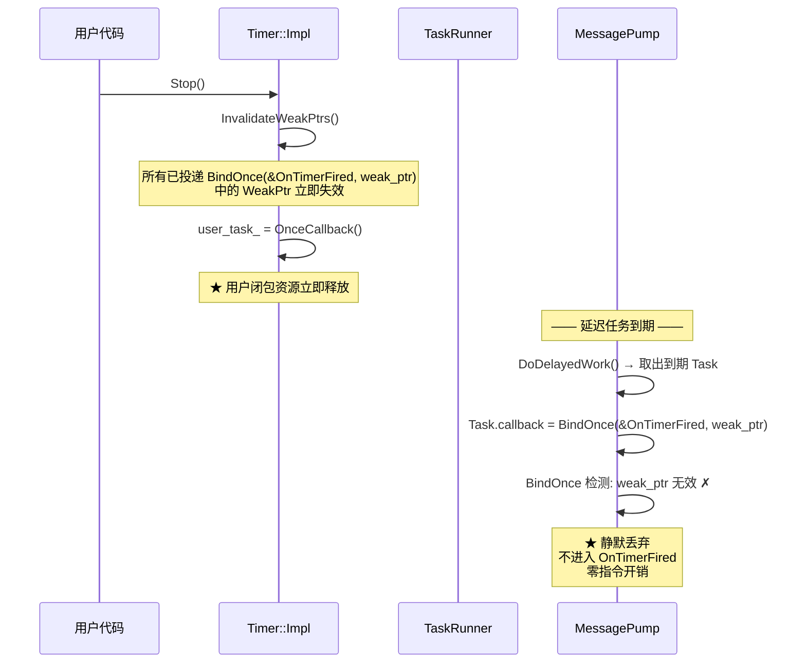
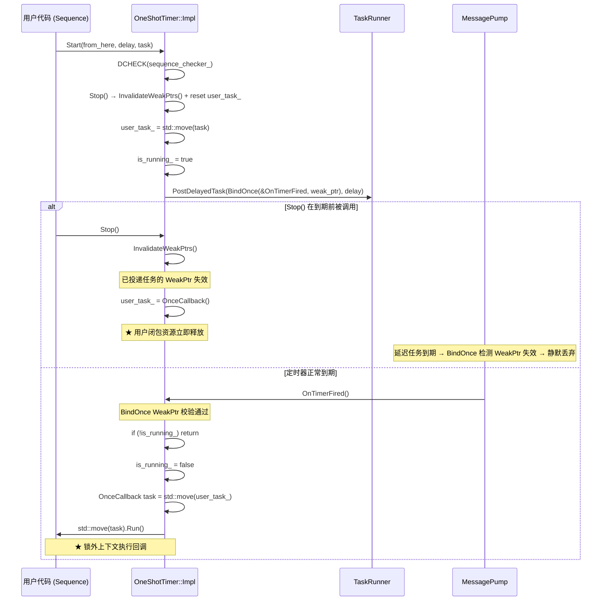
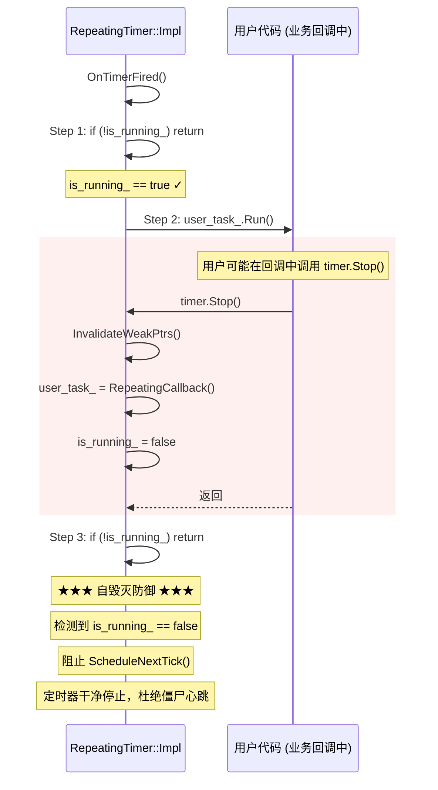
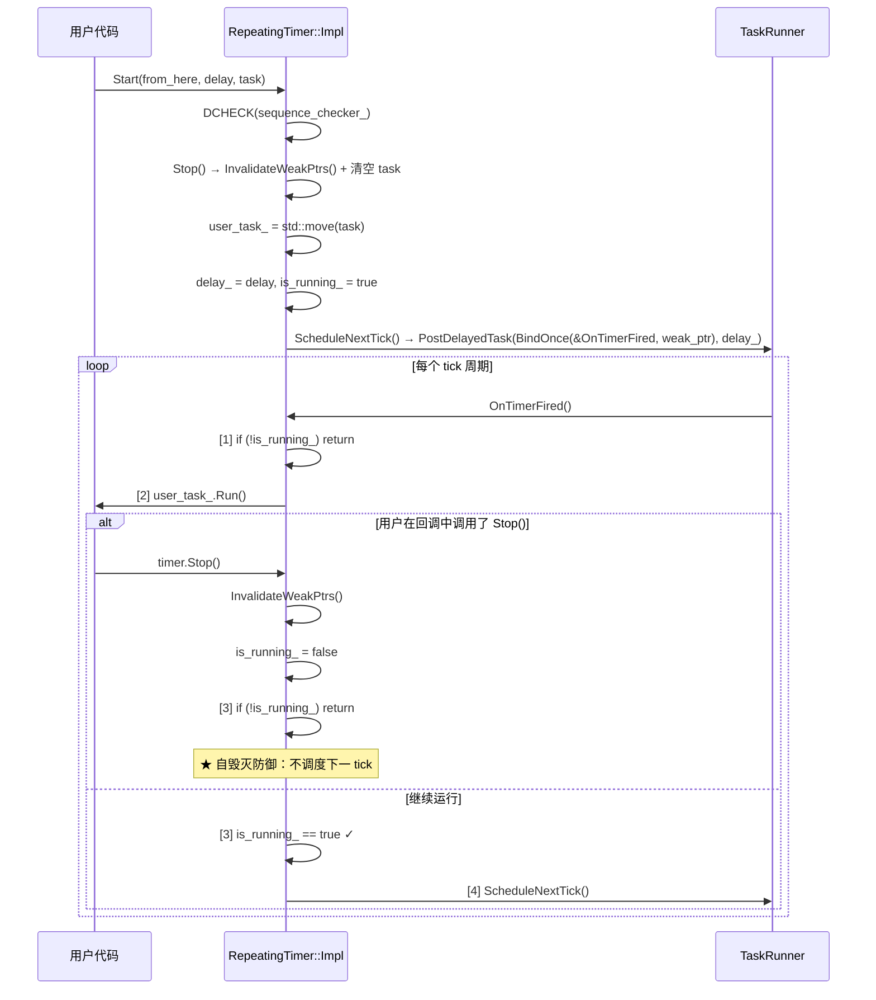

# OneShotTimer / RepeatingTimer 技术设计说明

## 1. 文档目标与范围

本文档描述 `neixx/task` 中 `OneShotTimer` 和 `RepeatingTimer` 的设计目标、内部机制、
并发安全模型、序列契约及典型使用范式。

本文档基于：

- `modules/neixx/task/include/neixx/task/timer.h`（公开 API）
- `modules/neixx/task/src/timer.cpp`（内部实现）
- `modules/neixx/task/include/neixx/task/task_runner.h`（`PostDelayedTask` 投递接口）
- `modules/neixx/functional/include/neixx/functional/bind.h`（`BindOnce` WeakPtr 校验）
- `modules/neixx/memory/include/neixx/memory/weak_ptr.h`（`WeakPtrFactory` / `InvalidateWeakPtrs`）
- `modules/neixx/task/include/neixx/task/sequence_checker.h`（序列绑定校验）

## 2. 模块定位

| 组件 | 定位 | 对标 Chromium |
|------|------|--------------|
| `OneShotTimer` | 单次高精度定时器——到期后执行一次用户回调，自动停止 | `base::OneShotTimer` |
| `RepeatingTimer` | 周期高精度定时器——每隔固定间隔重复执行用户回调，直到显式 Stop | `base::RepeatingTimer` |

**设计哲学：** 完全基于现有基础设施（`PostDelayedTask` + `WeakPtr`）构建，不引入额外线程、
定时器队列或内核定时对象。所有操作均在调用者序列上执行，零额外同步开销。

## 3. 核心机制

### 3.1 整体架构

```
┌─────────────────────────────────────────────────────────┐
│                    OneShotTimer (public)                 │
│                      PIMPL wrapper                       │
│                    std::unique_ptr<Impl>                  │
├─────────────────────────────────────────────────────────┤
│                  Impl (private, .cpp)                    │
│                                                          │
│  task_runner_  ──→ 绑定的 TaskRunner（序列）             │
│  sequence_checker_ ──→ 运行期序列合规校验 (DCHECK)       │
│  user_task_    ──→ 用户 OnceCallback                     │
│  is_running_   ──→ 定时器运行状态                        │
│  posted_from_  ──→ Start() 调用位置（诊断）              │
│                                                          │
│  weak_ptr_factory_ ← ★ 必须为最后一个成员                │
└─────────────────────────────────────────────────────────┘
```

### 3.2 零损耗取消 (Zero-Cost Cancellation)

`Stop()` 调用 `WeakPtrFactory::InvalidateWeakPtrs()`，使所有已投递的延迟任务的
`WeakPtr` 失效。当延迟任务在消息泵中唤醒时，`BindOnce` 的 `WeakPtr` 校验（见
`bind.h` 第 27 行）检测到失效，**静默丢弃调用**——无需进入 `OnTimerFired` 函数体，
无需额外锁定，无需跨线程信号。



### 3.3 OneShotTimer 完整执行流



### 3.4 RepeatingTimer 自毁灭防御 (Re-entrancy Guard)

**核心问题：** 用户可能在 `user_task_.Run()` 回调内部调用 `timer.Stop()`。
若回调返回后盲目调用 `ScheduleNextTick()`，则已"停止"的定时器会继续投递新任务，
形成僵尸心跳——每个新任务在 `WeakPtr` 失效后被静默丢弃，但持续消耗 CPU。

**解决方案：** `OnTimerFired()` 在执行用户回调后，**必须重新检查 `is_running_`**。



```
OnTimerFired() 关键代码:

    void OnTimerFired() {
        if (!is_running_) return;         // Step 1: 入口防御

        if (user_task_) {
            user_task_.Run();             // Step 2: 执行用户回调
        }

        if (!is_running_) return;         // Step 3: ★ 自毁灭防御
        ScheduleNextTick();               // Step 4: 仅 is_running_ 时调度
    }
```

### 3.5 RepeatingTimer 完整周期



## 4. 并发安全分析

### 4.1 单序列模型

两个 Timer 的所有操作（`Start`、`Stop`、`OnTimerFired`）均在**同一个序列**上执行：

- `SequenceChecker` 在 `Start()` / `Stop()` / `IsRunning()` 中强制执行 DCHECK 校验。
- `PostDelayedTask` 将回调投递到绑定的 `TaskRunner`，确保 `OnTimerFired` 在同一序列上执行。
- `is_running_` 和 `user_task_` 仅在该序列上读写，**无需锁保护**。

### 4.2 WeakPtr 跨序列安全

唯一的"跨序列"交互是延迟任务本身——它由消息泵在后台线程上维护，但其对 `Impl` 的
所有访问均通过 `WeakPtr` 中转：

| 场景 | 保护机制 |
|------|---------|
| `Stop()` 调用时，延迟任务仍在队列中 | `InvalidateWeakPtrs()` → 任务到期时 `BindOnce` 检测失败 → 静默丢弃 |
| `Impl` 析构 | `WeakPtrFactory::~WeakPtrFactory()` 自动 Invalidate → 同上 |
| 定时器触发正常执行 | `WeakPtr` 有效 → `OnTimerFired()` 安全执行 |

### 4.3 回调内重入安全性

| 操作 | OneShotTimer | RepeatingTimer |
|------|-------------|---------------|
| `Stop()` in callback | ✅ `user_task_` 已 move 到局部变量，`Stop()` 只操作空成员 | ✅ 重新检查 `is_running_`，阻止下一次 tick |
| `Start()` in callback | ✅ `user_task_` 已 move 出，`Start()` 的 `Stop()` 无害，然后正常启动新定时器 | ✅ `is_running_` 被 `Stop()` 置 false，`Start()` 随后重新设为 true 并调度 |
| 析构 in callback | ❌ 不允许——回调中不应析构宿主对象 | ❌ 不允许（DCHECK 保护） |

## 5. API 参考

### 5.1 OneShotTimer

```cpp
class OneShotTimer final {
public:
    // 构造。TaskRunner 在 Start() 时从当前线程获取。
    OneShotTimer();

    // 构造并绑定到指定 TaskRunner。
    explicit OneShotTimer(scoped_refptr<TaskRunner> task_runner);

    ~OneShotTimer();

    // 启动定时器。若已运行则先停止。必须在绑定序列上调用。
    void Start(const Location& from_here, TimeDelta delay, OnceCallback task);

    // 停止定时器。必须在绑定序列上调用。
    void Stop();

    // 查询是否正在运行。必须在绑定序列上调用。
    bool IsRunning() const;

    // 返回上次 Start() 的调用位置。
    const Location& posted_from() const;
};
```

### 5.2 RepeatingTimer

```cpp
class RepeatingTimer final {
public:
    RepeatingTimer();
    explicit RepeatingTimer(scoped_refptr<TaskRunner> task_runner);
    ~RepeatingTimer();

    void Start(const Location& from_here, TimeDelta delay, RepeatingCallback task);
    void Stop();
    bool IsRunning() const;
    const Location& posted_from() const;
};
```

## 6. 使用范例

### 6.1 单次超时保护

```cpp
#include <neixx/task/timer.h>
#include <neixx/task/thread_task_runner_handle.h>

class NetworkRequest {
public:
    void Start() {
        // 5 秒超时后取消请求
        timeout_timer_.Start(FROM_HERE, TimeDelta::FromSeconds(5),
                             BindOnce(&NetworkRequest::OnTimeout,
                                      weak_factory_.GetWeakPtr()));
        SendRequest();
    }

    void OnResponse() {
        timeout_timer_.Stop();  // 收到响应，取消超时
        ProcessResponse();
    }

private:
    void OnTimeout() {
        CancelRequest();
        NotifyError("request timed out");
    }

    OneShotTimer timeout_timer_;
    WeakPtrFactory<NetworkRequest> weak_factory_{this};
};
```

### 6.2 周期心跳/健康检查

```cpp
class HeartbeatMonitor {
public:
    void StartMonitoring() {
        heartbeat_timer_.Start(
            FROM_HERE,
            TimeDelta::FromSeconds(30),
            BindRepeating(&HeartbeatMonitor::SendHeartbeat,
                          weak_factory_.GetWeakPtr()));
    }

    void StopMonitoring() {
        heartbeat_timer_.Stop();  // 安全：可在回调内调用
    }

private:
    void SendHeartbeat() {
        DoSendHeartbeat();

        // 可在回调内根据条件动态停止
        if (consecutive_failures_ > 3) {
            StopMonitoring();
            NotifyConnectionLost();
        }
    }

    RepeatingTimer heartbeat_timer_;
    int consecutive_failures_ = 0;
    WeakPtrFactory<HeartbeatMonitor> weak_factory_{this};
};
```

### 6.3 显式 TaskRunner 绑定（跨线程使用）

```cpp
// 在 IO 线程上创建定时器，显式绑定 IO TaskRunner
auto io_runner = io_thread.GetTaskRunner();
auto timer = std::make_unique<OneShotTimer>(io_runner);

// 从任意线程触发（通过 PostTask 转到 IO 线程）
main_runner->PostTask(FROM_HERE, BindOnce(
    [](OneShotTimer* timer) {
        timer->Start(FROM_HERE, TimeDelta::FromMilliseconds(100),
                     BindOnce(&DoIOOperation));
    },
    timer.get()));
```

### 6.4 可取消延迟任务模式

```cpp
// 一次性检查：延迟执行某操作，但在满足条件时提前取消
class DebouncedSaver {
public:
    void OnDataChanged() {
        // 每次数据变更时重新开始计时，500ms 内无新变更则保存
        save_timer_.Start(FROM_HERE, TimeDelta::FromMilliseconds(500),
                          BindOnce(&DebouncedSaver::DoSave,
                                   weak_factory_.GetWeakPtr()));
    }

    void Shutdown() {
        save_timer_.Stop();  // 确保不会在析构后触发
    }

private:
    void DoSave() {
        PersistToDisk(data_);
    }

    OneShotTimer save_timer_;
    Data data_;
    WeakPtrFactory<DebouncedSaver> weak_factory_{this};
};
```

## 7. 已知限制与未来工作

| 限制 | 说明 | 计划 |
|------|------|------|
| 最小延迟受消息泵粒度约束 | `MessagePumpDefault` 的 `TimedWait` 使用毫秒级超时；`DelayedTaskManager` 使用 15ms 轮询粒度 | 未来引入 `timerfd`(Linux) / `WaitableTimer`(Windows) 平台定时器 API 提升精度 |
| 不支持绝对时间点触发 | 目前仅支持相对延迟 (`TimeDelta`)，不支持 `TimeTicks` 绝对截止时间 | 可新增 `StartAt(TimeTicks)` 重载 |
| 不支持 `RetainUserTask` | Chromium 的 `Timer` 支持保留 user_task 以便 `FireNow()` 后重新 `Reset()` | 暂不实现；`FireNow()` 可通过直接调用 `user_task.Run()` + `Stop()` 等效替代 |
| WSL/Docker 环境下定时精度略低 | 容器环境中 `TimedWait` 受宿主机调度抖动影响 | 不影响正确性，仅影响精度 |
