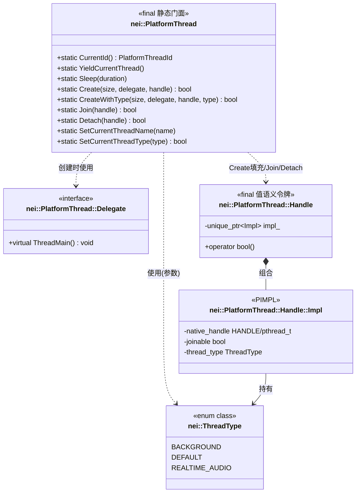
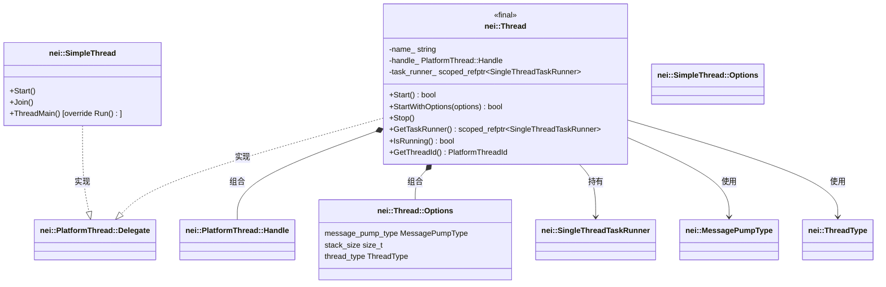
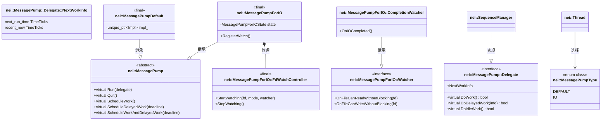
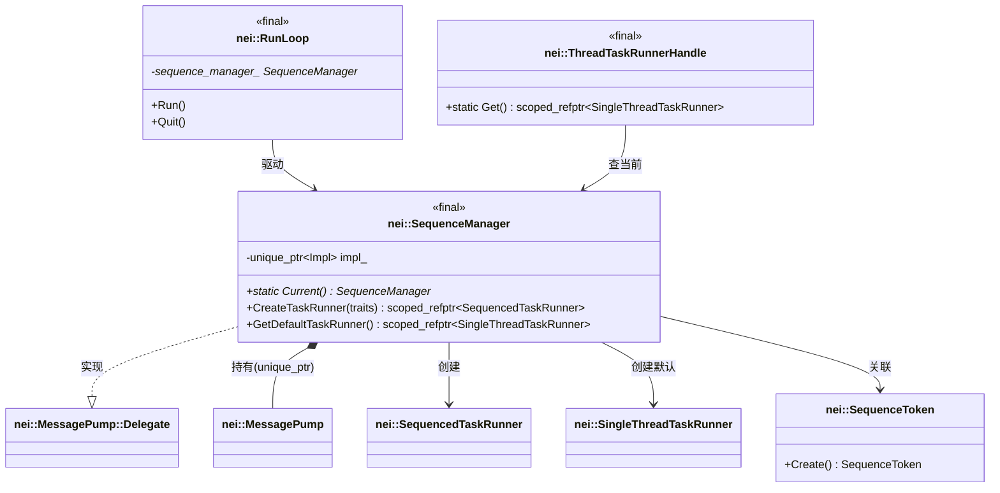
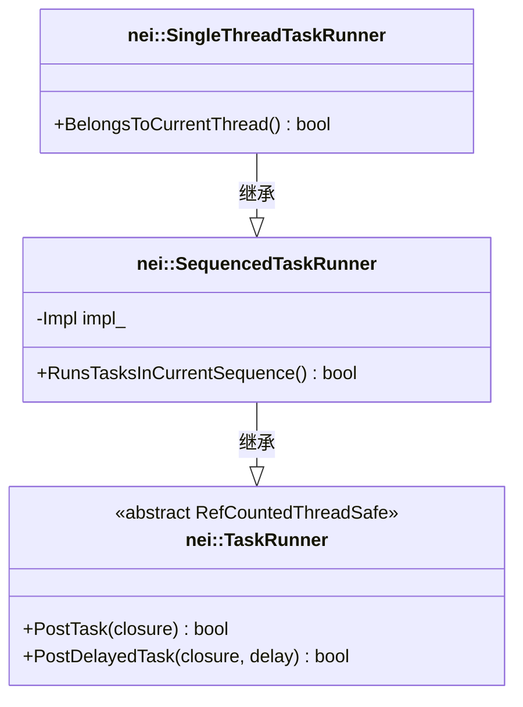
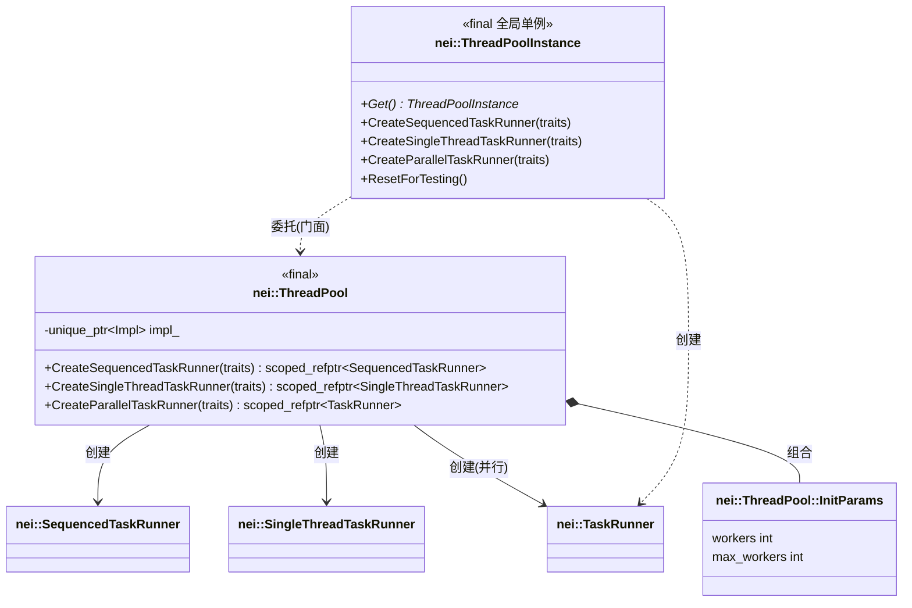
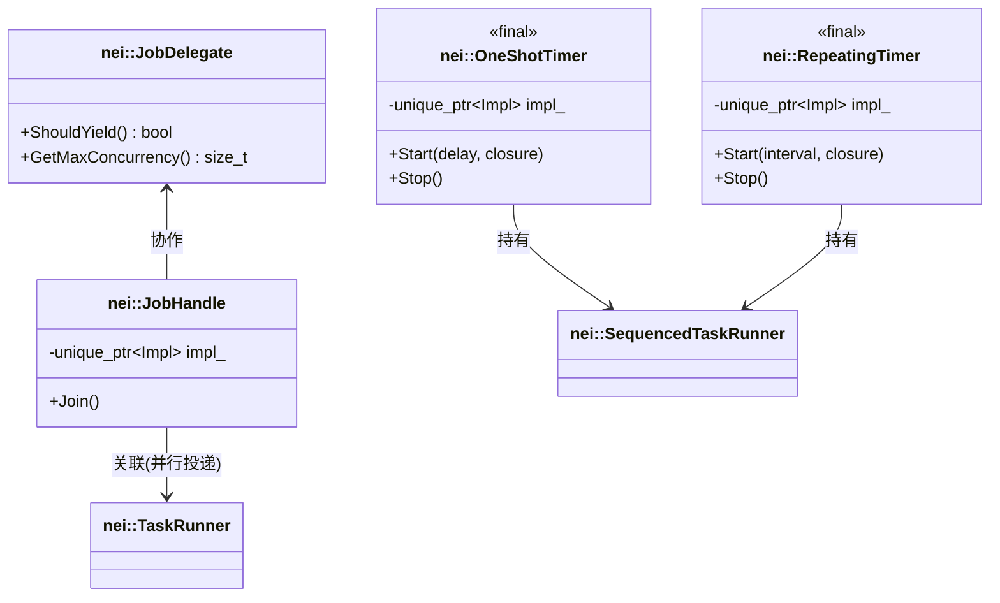
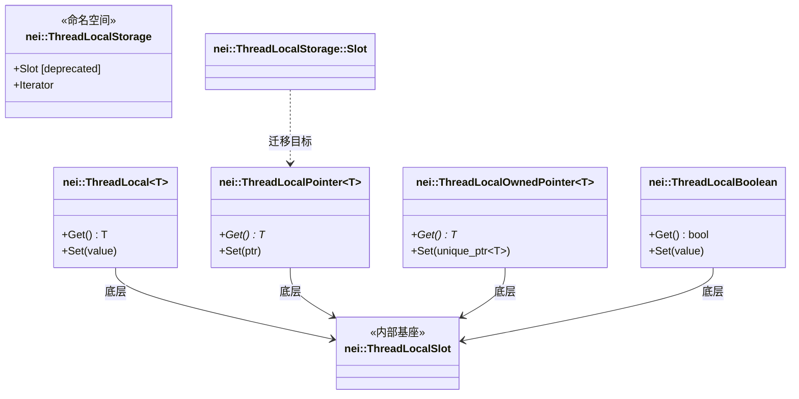
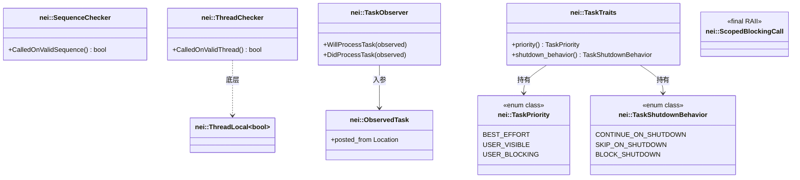
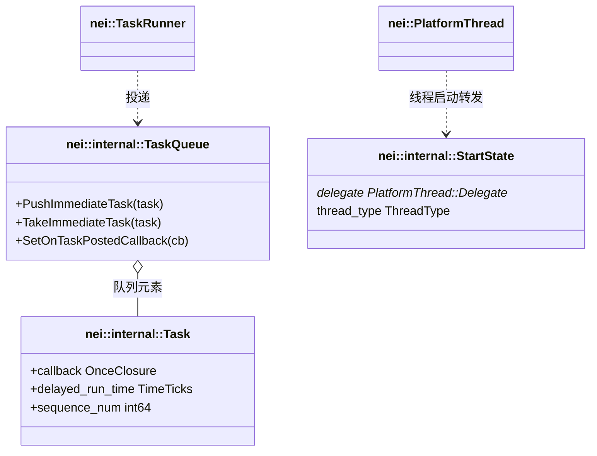

# neixx Task & Threading 模块类图

> 生成日期：2026-08-07
> 范围：`src/neixx/task` 与 `src/neixx/threading` 的公共 API 及关键内部协作类。
> 约定：类名统一使用反引号 `` ` `` 包裹（兼容 Mermaid 解析，尤其含 `::`、`<T>` 的类型）。

---

## 1. 模块总览

```mermaid
classDiagram
    direction LR

    subgraph threading [threading 模块]
        class `nei::Thread`
        class `nei::SimpleThread`
        class `nei::PlatformThread`
        class `nei::ThreadType`
        class `nei::ThreadLocal`
        class `nei::ThreadLocalStorage`
    end

    subgraph task [task 模块]
        class `nei::SequenceManager`
        class `nei::RunLoop`
        class `nei::MessagePump`
        class `nei::ThreadPool`
        class `nei::TaskRunner`
    end

    `nei::Thread` --> `nei::SequenceManager` : 拥有(经 TaskRunner)
    `nei::Thread` --> `nei::TaskRunner` : 持有
    `nei::RunLoop` --> `nei::SequenceManager` : 驱动
    `nei::SequenceManager` --> `nei::MessagePump` : 持有
    `nei::ThreadPool` --> `nei::TaskRunner` : 创建
```

---

## 2. 线程核心：PlatformThread / Delegate / Handle / ThreadType



---

## 3. 托管线程：Thread / SimpleThread



---

## 4. 消息泵体系



---

## 5. 序列与任务循环：SequenceManager / RunLoop



---

## 6. TaskRunner 继承体系



---

## 7. 线程池



---

## 8. 定时器与 Job



---

## 9. 线程本地存储（ThreadLocal 体系）



---

## 10. 诊断与辅助



---

## 附：关键内部协作类（`nei::internal`）


